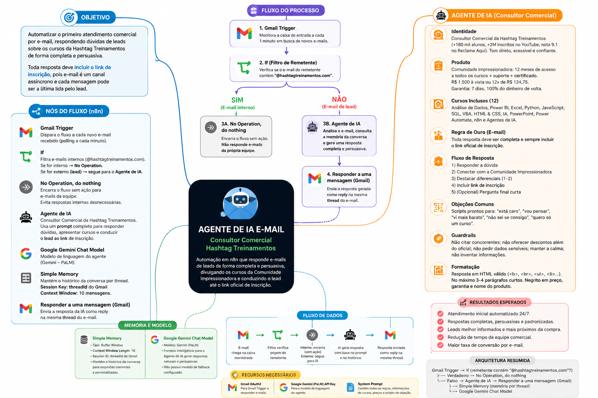
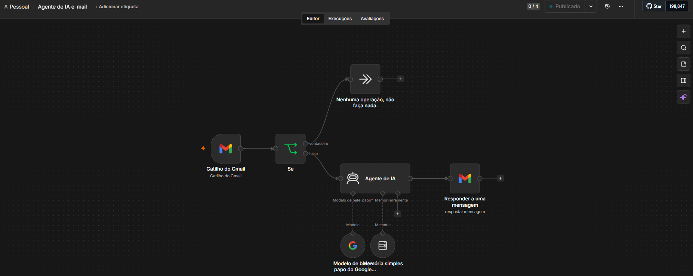
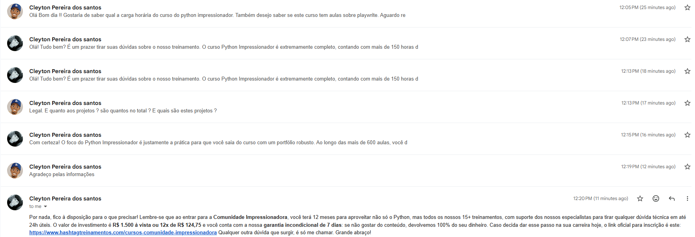

# Agente de IA e-mail — Consultor Comercial Hashtag Treinamentos

Automação em **n8n** que atua como consultor comercial por e-mail, respondendo dúvidas de leads interessados na **Comunidade Impressionadora** (pacote de cursos da Hashtag Treinamentos) e conduzindo-os até o link oficial de inscrição.

## Objetivo

Automatizar o primeiro atendimento comercial por e-mail, respondendo dúvidas sobre os cursos da Hashtag Treinamentos de forma completa e persuasiva — sempre incluindo o link de inscrição na própria resposta, já que e-mail é um canal assíncrono e cada mensagem pode ser a última lida pelo lead.

## Arquitetura do fluxo

```
Gmail Trigger → If (remetente contém "@hashtagtreinamentos.com"?)
                  ├── verdadeiro → No Operation, do nothing
                  └── falso      → AI Agent → Reply to a message (Gmail)
                                      ├── Simple Memory (memória por thread)
                                      └── Google Gemini Chat Model
```


## Nós (Nodes)

| Nó | Tipo | Função |
|---|---|---|
| **Gmail Trigger** | `gmailTrigger` | Dispara o fluxo a cada novo e-mail recebido (polling a cada minuto). |
| **If** | `if` | Verifica se o e-mail do remetente contém `@hashtagtreinamentos.com`. Se **verdadeiro**, o fluxo é interrompido (`No Operation`); se **falso** (ou seja, remetente externo/lead), segue para o `AI Agent`. |
| **No Operation, do nothing** | `noOp` | Encerra o fluxo sem ação quando o e-mail é de origem interna da Hashtag — evita que o agente responda a e-mails da própria equipe. |
| **AI Agent** | `langchain.agent` | Consultor comercial da Hashtag Treinamentos. Recebe o texto do e-mail e aplica o *system prompt* para gerar uma resposta comercial completa. |
| **Google Gemini Chat Model** | `lmChatGoogleGemini` | Modelo de linguagem do agente. Não há modelo de fallback configurado neste workflow. |
| **Simple Memory** | `memoryBufferWindow` | Mantém o histórico da conversa por thread (`sessionKey = threadId`), com janela de 10 mensagens. |
| **Reply to a message** | `gmail` (reply) | Envia a resposta da IA (`{{ $json.output }}`) como reply na mesma thread do Gmail. |

> ⚠️ Este workflow **não possui ferramentas (tools)** conectadas ao AI Agent — diferente do agente da Nova Lar Imóveis. Toda a informação sobre cursos, preços e condições vem embutida diretamente no *system prompt*, e não de uma consulta a planilha ou API externa.

## System Prompt (resumo)

O agente segue um prompt estruturado que define:

- **Identidade**: Consultor Comercial da Hashtag Treinamentos (+180 mil alunos, +2 milhões de inscritos no YouTube, nota 9.1 no Reclame Aqui). Tom direto, acessível e confiante, sem forçar a venda.
- **Produto**: Comunidade Impressionadora — 12 meses de acesso a todos os cursos + suporte de especialistas + certificado, por **R$ 1.500 à vista ou 12x de R$ 124,75**, com **garantia de 7 dias**.
- **Catálogo de cursos**: descrição detalhada (carga horária, nº de aulas, conteúdo) de cada um dos 12 cursos inclusos (Análise de Dados, Power BI, Excel, Python, JavaScript, SQL, VBA, HTML & CSS, IA, PowerPoint, Power Automate, n8n e Agentes de IA), para que o agente destaque apenas o curso relevante ao interesse do lead — sem listar tudo de uma vez.
- **Regra de ouro do canal e-mail**: toda resposta deve ser completa e sempre incluir o link oficial de inscrição, já que o lead pode não responder novamente.
- **Estrutura de resposta**: responder a dúvida → conectar com a Comunidade Impressionadora → destacar 1-2 diferenciais → incluir o link → (opcional) uma pergunta curta ao final.
- **Objeções comuns**: scripts de resposta para "está caro", "vou pensar", "vi mais barato", "não sei se consigo" e "quero só um curso".
- **Guardrails**: escopo restrito a cursos/carreira em tech, nunca citar concorrentes, nunca oferecer desconto além do oficial, nunca pedir dados sensíveis (CPF, senha, cartão), manter a calma com leads agressivos e nunca inventar informação que não sabe.
- **Formatação**: HTML válido (`<b>`, `<br>`, `<ul>/<li>`), no máximo 3-4 parágrafos curtos, com negrito em preço, garantia e nome do produto.

## Credenciais necessárias para importar/rodar

1. **Gmail OAuth2** — para o Gmail Trigger e para o nó de resposta (`Reply to a message`).
2. **Google Gemini (PaLM) API Key** — modelo de linguagem do agente.

## Fluxo de execução (passo a passo)

1. Lead envia e-mail para a caixa monitorada.
2. **Gmail Trigger** detecta a nova mensagem.
3. O nó **If** verifica o domínio do remetente:
   - Se for `@hashtagtreinamentos.com` (e-mail interno), o fluxo é encerrado sem resposta.
   - Caso contrário, segue para o **AI Agent**.
4. O **AI Agent** consulta a **Simple Memory** (histórico da thread) e gera a resposta comercial seguindo o *system prompt*.
5. **Reply to a message** envia essa resposta como reply na mesma thread do Gmail.

## Exemplo de uso

# Mapa mental do fluxo



# Diagrama do fluxo



# Exemplo de conversa por e-mail
No exemplo abaixo, o lead pergunta sobre a carga horária do curso Python Impressionador e se há aulas sobre Playwright. O agente responde detalhando o curso e, após a troca de mensagens, conduz o lead até a apresentação da Comunidade Impressionadora com preço, garantia e link de inscrição.



> 📌 Observação sobre o exemplo: nas duas primeiras respostas da IA, o texto aparece **repetido** (mesma resposta enviada duas vezes seguidas, às 12:07 e 12:13).Ocorre devido a dupla execução durante o teste do agente.

## Possíveis melhorias futuras

- Investigar e corrigir a duplicidade de resposta observada no teste (ver observação acima) — possivelmente adicionando um controle de idempotência (ex: marcar e-mail como lido/processado, ou checar se já existe reply na thread antes de responder novamente).
- Adicionar um modelo de **fallback** (ex: DeepSeek, como no projeto da Nova Lar Imóveis), já que atualmente o agente depende exclusivamente do Google Gemini.
- Avaliar se a condição do nó **If** deveria ser invertida/documentada de forma mais explícita — hoje ela filtra e-mails internos da Hashtag, mas o nome do nó não deixa isso claro para quem for dar manutenção no fluxo.
- Considerar adicionar uma ferramenta (tool) de registro de leads (Google Sheets/CRM), semelhante ao `Registrar_lead` do projeto da Nova Lar Imóveis, para dar visibilidade comercial aos contatos recebidos.
